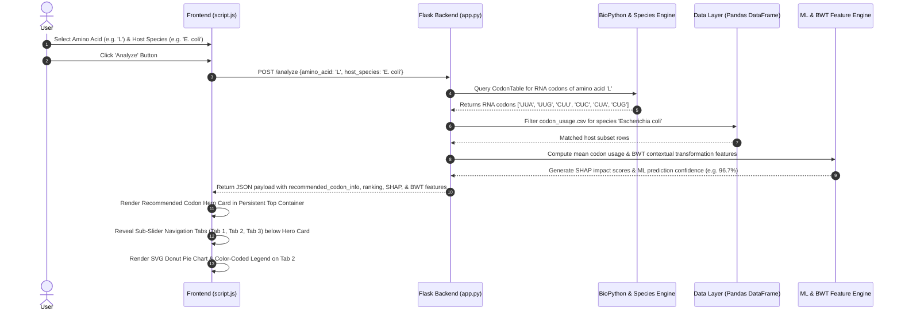

# Technical Architecture & System Design 🏗️

**Document Version:** 1.0.0  
**Project:** Codon Usage Tool & Explainable AI (XAI) Dashboard  

---

## 📐 High-Level System Architecture

The application follows a lightweight, high-performance **Micro-Monolith Architecture**. The Python Flask backend acts as a RESTful computational engine that processes genomic queries against pre-loaded datasets and machine learning model artifacts, serving a dynamic single-page web front end.

```mermaid
graph TD
    A[Client Web Browser] -->|HTTP POST /analyze| B[Flask Server app.py]
    A -->|HTTP GET /| B
    A -->|HTTP GET /health| B

    subgraph Backend Execution Engine
        B --> C[Data Layer]
        B --> D[Biological Rule Engine]
        B --> E[Machine Learning & XAI Engine]

        C -->|Load & Index| C1[(codon_usage.csv ~70k rows)]
        C -->|Metrics| C2[(evaluation_metrics.json)]

        D -->|Translate| D1[BioPython CodonTable RNA/DNA]
        D -->|Alias Lookup| D2[Species Mapping & Kingdom Stats]

        E -->|Feature Engineering| E1[Burrows-Wheeler Transform BWT]
        E -->|Feature Importance| E2[SHAP Value Computation]
        E -->|Model Predictions| E3[Codon+BWT Model Artifacts]
    end

    B -->|JSON Response Payload| A
    A -->|Render Components| F[Frontend Dashboard UI]
    F --> F0[Top Navbar: Home | Metrics | Proof]
    F --> F1[Persistent Top Container: Inputs & Recommended Codon Card]
    F --> F2[Sub-Slider Tab Bar below Hero Card]
    F2 --> F2A[Tab 1 Biological Interpreter]
    F2 --> F2B[Tab 2 Organism Usage & SVG Donut Pie Chart]
    F2 --> F2C[Tab 3 ML & SHAP Interpretability]
```

---

## 🔄 End-to-End Execution & Data Flow



---

## 📁 Repository Folder & File Architecture

```text
CodonBwt_FinalYr_Project-main/
├── app.py                            # Main Flask server, route controllers, and analysis pipeline
├── codon_usage.csv                   # Primary genomic codon usage dataset (~70,000 organisms)
├── codon_bwt_robustness_analysis.csv # Evaluation data across clean, noisy, and missing data scenarios
├── bwt-codon.ipynb                   # Jupyter notebook for BWT sequence extraction & ML training
├── evaluate_metrics.ipynb            # Jupyter notebook for generating confusion matrices & metrics
├── feature_manifest_with_bwt.json    # JSON feature index mapping file
├── final_features_with_bwt.csv       # Merged dataset containing codon frequencies + BWT features
├── index.html                        # Single Page Application (SPA) HTML frame
├── requirements.txt                  # Python dependencies
├── render.yaml                       # Cloud deployment specification for Render
├── readme.md                         # Project setup and documentation
├── PRD.md                            # Product Requirements Document
├── Architecture.md                   # System Architecture & Technical Specifications
├── Design.md                         # Design System & UI Specs
│
├── Training_code/                    # Model training scripts and raw notebooks
│   └── bwt-codon.ipynb               # Copy of BWT feature extraction & training code
│
├── model_outputs/                    # Trained Machine Learning artifacts
│   ├── aa_models_with_bwt.pkl        # Amino-acid specific trained models
│   ├── global_clf_codon_bwt.pkl      # Global classification model object
│   ├── global_codon_bwt_model.pkl    # Global pipeline model object
│   ├── global_le_codon_bwt.pkl       # Target species label encoder
│   ├── label_encoder.pkl             # Label encoder object
│   ├── evaluation_metrics.json       # Exported model evaluation metrics
│   ├── per_AA_stats_with_bwt.csv     # Statistical breakdown per amino acid
│   ├── species_id_map.json           # Species mapping table
│   └── *.png                         # Output diagnostic graphs & visualizations
│
└── static/                           # Client-side static assets
    ├── style.css                     # Custom CSS design system & responsive stylesheet
    ├── script.js                     # Vanilla JS controller & frontend renderer
    └── *.png                         # Visual proof images for Training Proof page
```

---

## 🛠️ Technical Stack Specifications

| Layer | Technology | Version / Tool | Purpose |
|---|---|---|---|
| **Backend Framework** | Python / Flask | 3.10+ / Flask 3.0+ | Lightweight WSGI web server and REST API handler |
| **CORS Middleware** | Flask-CORS | 4.0+ | Handles cross-origin requests securely |
| **Data Processing** | Pandas / NumPy | 2.0+ / 1.24+ | In-memory filtering and vectorized statistical computations |
| **Genetics Library** | BioPython | 1.81+ | NCBI genetic code tables and RNA/DNA codon translation |
| **Machine Learning** | XGBoost / Scikit-Learn | 1.7+ / 1.3+ | Model training, classification, and label encoding |
| **Explainable AI** | SHAP | 0.42+ | Calculates feature attribution scores for model outputs |
| **Frontend Framework** | Vanilla HTML5 / CSS3 / JavaScript (ES6+) | Native Browser APIs | Single-page responsive dashboard interface |
| **Deployment / Server**| Gunicorn / Render | Gunicorn 21+ | Production WSGI application server |

---

## 🧬 Core Algorithms & Technical Specifications

### 1. Codon Usage Bias (CUB) Calculation
Given an amino acid $A$ encoded by a set of synonymous codons $C_A = \{c_1, c_2, \dots, c_k\}$, the relative usage frequency $f(c_i)$ of codon $c_i$ in host species subset $S$ is computed as:

$$f(c_i) = \frac{1}{|S|} \sum_{s \in S} U(c_i, s)$$

Where $U(c_i, s)$ represents the empirical usage fraction of codon $c_i$ in organism $s$.

### 2. Burrows-Wheeler Transform (BWT) Feature Engineering
Standard tabular models analyze codons in isolation without spatial context. The BWT algorithm transforms the sequence string $T$ into $L = \text{BWT}(T)$ by lexically sorting all cyclic rotations of $T$. 

In this project, BWT captures sequence context features:
1. **$BWT_1, BWT_2, BWT_3$**: Positional transformations capturing adjacent nucleotide pair biases.
2. **$BWT_{\text{Rotation}}$**: Cyclical context representation preserving reading frame alignment.
3. **$BWT_{\text{Pattern}}$**: Frequency of repeating sub-motifs (e.g., GC-rich clusters).

### 3. SHAP (SHapley Additive exPlanations) Value Calculation
For model output prediction $f(x)$ for feature vector $x$, the attribution $\phi_i$ of feature $i$ (codon or BWT component) is computed as:

$$\phi_i(x) = \sum_{S \subseteq F \setminus \{i\}} \frac{|S|!(|F| - |S| - 1)!}{|F|!} \left[ f_S(x \cup \{i\}) - f_S(x) \right]$$

- **$\phi_i > 0$ (Green)**: Increases prediction confidence for recommending codon $c_i$.
- **$\phi_i < 0$ (Red)**: Decreases confidence (indicates sub-optimal codon choice).
